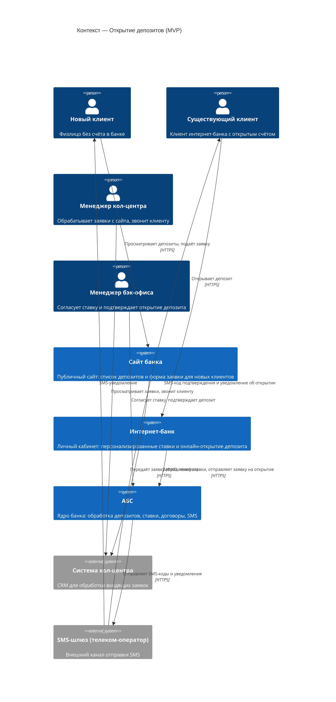
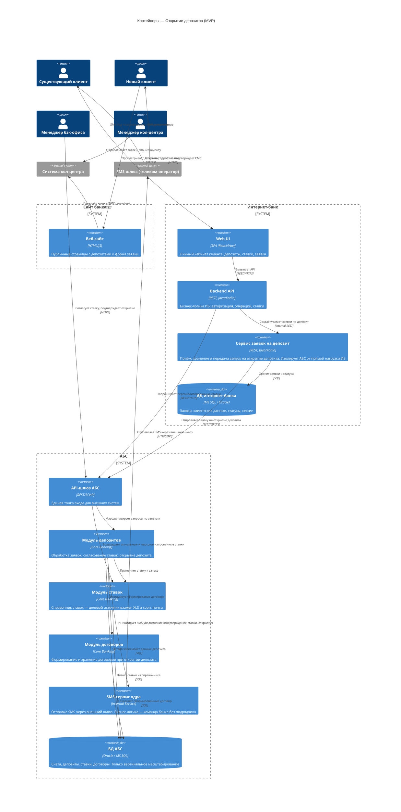

### **Название задачи:**

Концептуальная архитектура системы открытия депозитов (MVP)

### **Автор:**

Куприк Александр

### **Дата:**

2026-07-03

---

### **Функциональные требования**

| **№** | **Действующие лица или системы**                  | **Use Case**                                                | **Описание**                                                                                              |
| :---: | :------------------------------------------------ | :---------------------------------------------------------- | :-------------------------------------------------------------------------------------------------------- |
|   1   | Новый клиент, Сайт                                | Просмотр депозитов на сайте                                 | Новый клиент открывает публичный сайт и видит список доступных депозитов с актуальными ставками           |
|   2   | Новый клиент, Сайт, Система кол-центра            | Подача заявки на депозит через сайт                         | Клиент заполняет форму с ФИО и номером телефона. Заявка автоматически передаётся в систему кол-центра     |
|   3   | Менеджер кол-центра, Система кол-центра           | Обработка заявки менеджером кол-центра                      | Менеджер видит заявку в CRM, звонит клиенту, при необходимости предлагает индивидуальные условия          |
|   4   | Новый клиент, Сотрудник отделения, АБС            | Идентификация в отделении                                   | Новый клиент приходит в отделение для очной идентификации — обязательное требование законодательства      |
|   5   | Существующий клиент, Интернет-банк, АБС           | Просмотр депозитов в интернет-банке                         | Авторизованный клиент видит список депозитов с актуальными и персонализированными ставками                |
|   6   | Существующий клиент, Интернет-банк, АБС, SMS-шлюз | Подача заявки на открытие депозита                          | Клиент указывает счёт и сумму, подаёт заявку и подтверждает её СМС-кодом                                  |
|   7   | Менеджер бэк-офиса, АБС                           | Согласование ставки и подтверждение открытия депозита (MVP) | Менеджер просматривает заявку в АБС, согласует ставку и подтверждает открытие депозита                    |
|   8   | АБС, SMS-шлюз, Клиент                             | Уведомление клиента о результатах                           | После подтверждения ставки и открытия депозита АБС формирует договор и отправляет SMS-уведомления клиенту |

---

### **Нефункциональные требования**

| **№** | **Требование**                                                                                           |
| :---: | :------------------------------------------------------------------------------------------------------- |
|   1   | Доступность всех сервисов — 99,9%, круглосуточно 24×7                                                    |
|   2   | Время отклика пользовательских операций — миллисекунды                                                   |
|   3   | Загрузка справочных данных (ставки, счета) — не более 1 секунды                                          |
|   4   | Интернет-банк не обращается к API АБС напрямую в новом процессе (БД АБС перегружена)                     |
|   5   | Высокая нагрузка от онлайн-заявок не должна снижать производительность АБС                               |
|   6   | Весь внешний трафик защищён шифрованием (HTTPS/TLS)                                                      |
|   7   | Операция открытия депозита подтверждается СМС-кодом                                                      |
|   8   | Горизонтальное масштабирование компонентов интернет-банка; АБС — только вертикальное                     |
|   9   | При сбое основного ЦОД — переключение на резервный                                                       |
|  10   | Приоритет существующим технологиям банка (MS SQL, Oracle); новые технологии совместимы и понятны команде |
|  11   | SMS-функционал реализуется командой банка без привлечения подрядчика                                     |
|  12   | Соблюдение корпоративной дизайн-системы: фирменные цвета и брендированные элементы                       |

---

### **Решение**

#### Описание решения

Решение охватывает два канала открытия депозитов для MVP:

**Канал 1 — Сайт (новые клиенты):**
Новый клиент оставляет заявку на публичном сайте (ФИО + телефон) → заявка передаётся в систему кол-центра → менеджер кол-центра звонит клиенту и согласовывает условия → клиент приходит в отделение для идентификации личности.

**Канал 2 — Интернет-банк (существующие клиенты):**
Клиент выбирает депозит с персонализированными ставками → указывает счёт и сумму → подтверждает заявку СМС-кодом → менеджер бэк-офиса согласует в АБС → клиент получает SMS-уведомление об открытии депозита и договор.

**Ключевые архитектурные решения:**

- **Изоляция АБС от прямых онлайн-вызовов:** В интернет-банк вводится отдельный Сервис заявок на депозит. Он принимает и хранит заявки в собственной БД. Запросы на открытие депозитов и синхронизация со ставками идут через управляемый API-шлюз с очередью (Queue/Kafka). Это позволяет:
  - Защитить БД АБС от прямой перегрузки онлайн-нагрузкой
  - Контролировать пропускную способность через rate limiting
  - Буферизировать пики запросов во время пиковых часов
  - Реализовать graceful degradation при сбоях АБС
- **SMS:** Используется существующий SMS-сервис ядра АБС. Бизнес-логика (триггеры, тексты) дорабатывается командой банка без подрядчика.
- **Шифрование:** Весь внешний трафик — HTTPS/TLS как для сайта, так и для интернет-банка.
- **Стек:** MS SQL / Oracle, существующие платформы разработки банка.
- **Очередь сообщений (Kafka):** Для разгрузки и контроля нагрузки на АБС сервис депозитов должен отправлять заявки и запросы на открытие депозитов в очередь, а не напрямую в АБС. Это позволит:
  - Буферизировать пики нагрузки
  - Обеспечить гарантированную доставку
  - Реализовать retry logic для отказов
  - Мониторить и контролировать пропускную способность
  
  На MVP используется синхронный API-шлюз с кэшированием (для справочных данных) и очередью для асинхронных операций (обновление ставок, синхронизация). Полная миграция на Kafka запланирована на вторую фазу - текущая платформа интернет-банка несовместима. Решение проектируется так, чтобы переход был прозрачен для клиентских интерфейсов.

---

#### Диаграмма контекста (C4 Level 1)

---

#### Диаграмма контейнеров (C4 Level 2)

Детализированы: **Интернет-банк** и **АБС**.

---

### **Альтернативы**

| **Альтернатива**                                      | **Причина отклонения**                                                                                                                                    |
| :---------------------------------------------------- | :-------------------------------------------------------------------------------------------------------------------------------------------------------- |
| Прямая синхронная интеграция интернет-банка с API АБС | БД АБС перегружена — онлайн-нагрузка от заявок поставит под угрозу работоспособность банка (R3, P4)                                                       |
| Асинхронная интеграция через Kafka                    | Перспективное направление, отложено: текущая платформа ИБ несовместима с Kafka (+R6). Решение спроектировано с возможностью добавления брокера в пост-MVP |
| Доработка SMS-механизма силами подрядчика             | Нежелательно — лучше реализовать собственной командой банка (+R4)                                                                                         |
| Хранение ставок в XLS + корпоративная почта (as-is)   | Не масштабируется, подвержено ошибкам, не поддерживает онлайн-запросы из ИБ. Требует замены в рамках F8                                                   |
| Единый сервис заявок для обоих каналов (сайт + ИБ)    | Различные акторы и жизненный цикл заявок; разделение упрощает независимое масштабирование и развитие каналов                                              |

---

### **Недостатки, ограничения, риски**

| **№** | **Описание**                                                                                                      |
| :---: | :---------------------------------------------------------------------------------------------------------------- |
|   1   | АБС масштабируется только вертикально — потолок производительности при росте нагрузки на депозиты                 |
|   2   | Текущий ИБ несовместим с Kafka — асинхронная шина недоступна без обновления платформы ИБ                          |
|   3   | Обязательный визит нового клиента в отделение для идентификации снижает конверсию онлайн-воронки                  |
|   4   | Ставки по-прежнему хранятся в XLS и распространяются через корп. почту — риск ошибок до ввода модуля ставок в АБС |
|   5   | Сайт и ИБ архитектурно развёрнуты в контуре АБС — усложняет переход на микросервисы                               |
|   6   | MVP предполагает ручную обработку заявок менеджером бэк-офиса — узкое место при росте объёма заявок               |
|   7   | Внешняя зависимость от SMS-шлюза телеком-оператора требует SLA-соглашения и мониторинга доступности               |
|   8   | Сервис заявок на депозит — новый компонент, требует разработки и нагрузочного тестирования                        |
