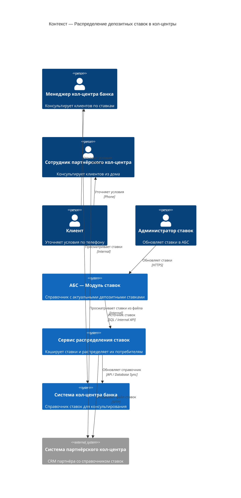
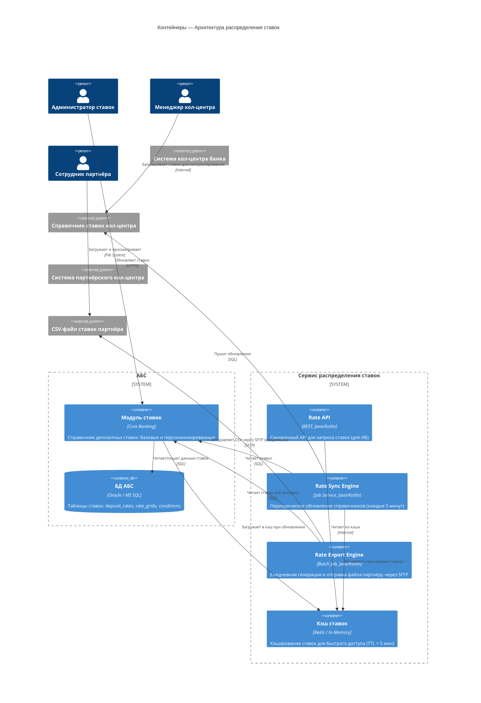

### **Название задачи:**

Архитектура передачи ставок в кол-центр

### **Автор:**

Куприк Александр

### **Дата:**

2026-07-06

---

### **Функциональные требования**

| **№** | **Действующие лица или системы**                    | **Use Case**                            | **Описание**                                                                                                                                                   |
| :---: | :-------------------------------------------------- | :-------------------------------------- | :------------------------------------------------------------------------------------------------------------------------------------------------------------- |
|   1   | Менеджер кол-центра банка, система кол-центра       | Просмотр актуальных ставок по депозитам | Менеджер кол-центра видит в своей системе текущие ставки банка для консультирования клиентов по телефону                                                       |
|   2   | Сотрудник партнёрского кол-центра, система партнёра | Получение актуальных ставок             | Партнёрский кол-центр получает файл с актуальными ставками для консультирования клиентов                                                                       |
|   3   | Менеджер кол-центра банка                           | Консультирование клиента по ставкам     | Менеджер консультирует клиента по текущим условиям открытия депозита и может предложить индивидуальные условия на основе имеющихся ставок                      |
|   4   | Сотрудник бэк-офиса банка (управление ставками)     | Публикация новых ставок                 | Сотрудник обновляет ставки в системе управления ставками АБС; изменение автоматически становится доступно кол-центру                                           |
|   5   | Процесс (автоматизированный)                        | Периодическая передача ставок партнёру  | Система АБС или промежуточный сервис периодически (по расписанию или по событию) отправляет актуальные ставки партнёрскому кол-центру в виде файла (SFTP, CSV) |

---

### **Нефункциональные требования**

| **№** | **Требование**                                                                                                         |
| :---: | :--------------------------------------------------------------------------------------------------------------------- |
|   1   | Менеджеры кол-центра должны видеть актуальные ставки в реальном времени или с минимальной задержкой (не более 5 минут) |
|   2   | Партнёрский кол-центр получает обновления ставок один раз в день или по требованию (не требует реального времени)      |
|   3   | Ставки передаются в виде файла (CSV/Excel) через защищённый канал (SFTP/HTTPS)                                         |
|   4   | При обновлении ставок в АБС все потребители (ИБ, кол-центр, партнёр) должны синхронизироваться                         |
|   5   | Решение не должно требовать прямого API-доступа партнёрского кол-центра к системам банка                               |
|   6   | Шифрование в пути и на диске для всех передач ставок (конфиденциальность)                                              |

---

### **Решение**

#### Описание решения

Решение обеспечивает распределение депозитных ставок по трём потребителям с разными требованиями:

1. **Интернет-банк (ИБ)**: синхронный запрос ставок при открытии сессии клиента → кэширование на 5 минут
2. **Кол-центр банка**: регулярное обновление справочника ставок в рамках работы системы кол-центра → обновление каждые 5 минут
3. **Партнёрский кол-центр**: асинхронная передача файла со ставками → один раз в день или по требованию через SFTP

**Ключевая архитектурная идея:**

Вводится **Сервис распределения ставок (Rate Distribution Service)**, который:

- Читает ставки из **модуля ставок АБС** (единый источник истины)
- Кэширует их в памяти или локальной БД
- Предоставляет ставки ИБ через REST API (синхронно)
- Обновляет справочник в системе кол-центра банка (периодически, каждые 5 мин)
- Генерирует и отправляет CSV-файл партнёрскому кол-центру через SFTP (один раз в день или по расписанию)

**Преимущества:**

- Единая точка управления ставками (модуль ставок АБС)
- Безопасная, управляемая передача в партнёрский кол-центр (без API)
- Масштабируемость: новые потребители добавляются через конфигурацию сервиса
- Асинхронность изолирует нагрузку на АБС

---

#### Диаграмма контекста (C4 Level 1)

---

#### Диаграмма компонентов (C4 Level 2)

Детализированы: **АБС (модуль ставок)**, **Сервис распределения ставок** и **интеграции с потребителями**.

---

### **Альтернативы**

| **Альтернатива**                                                    | **Причина отклонения или отложения**                                          |
| :------------------------------------------------------------------ | :---------------------------------------------------------------------------- |
| API-доступ партнёрского кол-центра напрямую к AБС                   | Партнёр не может сделать API-вызовы; требуется файловый обмен (SFTP)          |
| Предоставить партнёру доступ к БД АБС напрямую                      | Критический риск безопасности и перегрузки БД; требуется промежуточный сервис |
| Реал-тайм изменения ставок для партнёра через message queue (Kafka) | Партнёр не поддерживает; файловый обмен более управляем                       |
| Хранение копии ставок в каждой системе без синхронизации            | Риск рассинхронизации; единый источник истины (АБС) обязателен                |
| Предоставить кол-центру напрямую API АБС                            | Излишняя нагрузка на АБС; кэш + периодическое обновление безопаснее           |

---

### **Недостатки, ограничения, риски**

| **№** | **Описание**                                                                                                                                                    |
| :---: | :-------------------------------------------------------------------------------------------------------------------------------------------------------------- |
|   1   | **Задержка обновления для партнёра:** ставки обновляются раз в день — если банк срочно изменит ставку, партнёр узнает только завтра                             |
|   2   | **Ставки по-прежнему в XLS:** процесс всё ещё полуручной (администратор заходит в АБС и меняет ставки); требуется полный модуль управления ставками в АБС       |
|   3   | **Безопасность файла:** CSV-файл со ставками передаётся через SFTP; нужна защита от перехвата (TLS, шифрование в пути)                                          |
|   4   | **Масштабируемость на стороне кол-центра банка:** частая синхронизация (каждые 5 минут) может создать нагрузку на систему кол-центра                            |
|   5   | **Зависимость от расписания:** Batch Job для экспорта файла может вывести из строя весь процесс; нужна хорошая обработка ошибок                                 |
|   6   | **Кэш может устареть:** если сервис упадёт, ставки не будут обновляться до перезагрузки; нужна перезагрузка при запуске                                         |
|   7   | **Управление версионированием файлов:** при ежедневной отправке файла как отличить актуальные ставки от старых? Нужна версионизация или таймстемп в имени файла |
|   8   | **Отсутствие обратной связи:** если партнёр не загрузил файл, банк не узнает; нужны логи и мониторинг доставки                                                  |
